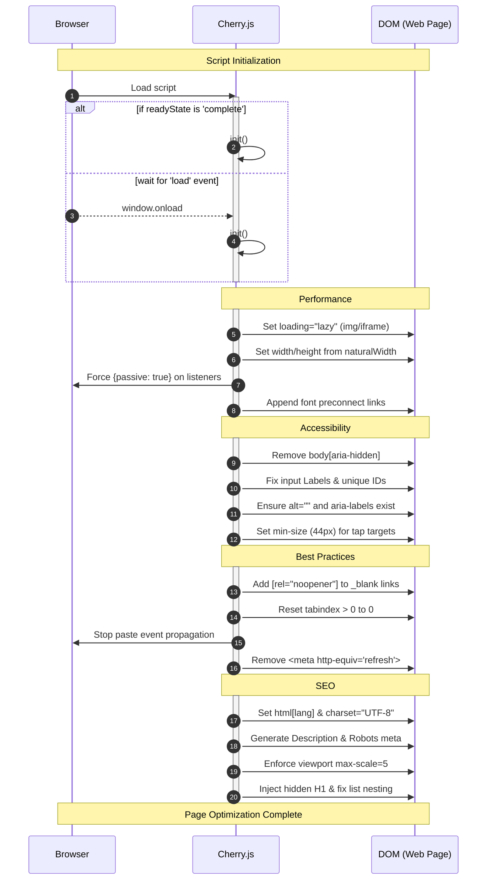

# 🍒 Cherry

**A native, zero-config optimization engine for the modern web.**

Cherry.js is a library designed to bridge the gap between semantic design and technical performance. It identifies common accessibility gaps, SEO omissions, and performance bottlenecks (like Cumulative Layout Shift) and patches them at runtime during browser idle periods.

---

## 🌟 Why Cherry?

cherry builds upon the on-the-fly philosophy, ensuring that sites remain optimized without any trade-off:

* **Zero Technical Debt:** Patches legacy HTML for WCAG and SEO compliance without changing a line of source code.
* **Idle-Time Execution:** Utilizes `requestIdleCallback` to perform DOM surgery only when the browser is idle, protecting your Total Blocking Time (TBT).

---

## 🚀 Installation

**CDN** (*recommended*):

1. Simply add this in your `<head>` tag:

    ```html
    <script src="https://cdn.jsdelivr.net/gh/kaiserrrrrr/cherry/src/cherry.min.js" defer></script>
    ```

**Manually**:

1. Download the file:

    ```bash
    wget "https://cdn.jsdelivr.net/gh/kaiserrrrrr/cherry/src/cherry.min.js"
    ```

    **OR** download directly:
    [cherry](https://cdn.jsdelivr.net/gh/kaiserrrrrr/cherry/src/cherry.min.js)

2. Link it from HTML:

    ```html
    <script src="cherry.min.js"defer></script>
    ```

---

## ❓ How it works



---

## 🌐 Browsers supported

| [](http://godban.github.io/browsers-support-badges/)<br/>Edge | [](http://godban.github.io/browsers-support-badges/)<br/>Firefox | [](http://godban.github.io/browsers-support-badges/)<br/>Chrome | [](http://godban.github.io/browsers-support-badges/)<br/>Safari | [](http://godban.github.io/browsers-support-badges/)<br/>iOS Safari | [](http://godban.github.io/browsers-support-badges/)<br/>Samsung | [](http://godban.github.io/browsers-support-badges/)<br/>Opera |
| --------- | --------- | --------- | --------- | --------- | --------- | --------- |
| Edge | Last 68 versions | Last 65 versions | Last 6 versions | Last 6 versions | Last 16 versions | Last 60 versions |

---

## 📜 License

&copy; Cherry 2026. Code released under the [GNU General Public License v3.0](https://github.com/kaiserrrrrr/cherry/blob/master/LICENSE).

---
Built with 🍒 and Blossom.
