# 🍒 Cherry

**A native, zero-config optimization engine for the modern web.**

Cherry.js is a "healing" library designed to bridge the gap between semantic design and technical performance. It identifies common accessibility gaps, SEO omissions, and performance bottlenecks (like Cumulative Layout Shift) and patches them at runtime during browser idle periods.

---

## 🌟 Why Cherry?

Most performance tools only *report* errors; Cherry **fixes** them. Built on the principle of **"In-Flight Repair"**, it offers:

* **Zero Technical Debt:** Patches legacy HTML for WCAG and SEO compliance without changing a line of source code.
* **Idle-Time Execution:** Utilizes `requestIdleCallback` to perform DOM surgery only when the browser is idle, protecting your Total Blocking Time (TBT).
* **Aesthetic Preservation:** Allows designers to focus on the visual layer while the engine handles the technical enforcement underneath.

---

## 🚀 Installation

**CDN** (*recommended*):

1. Simply add this in your `<head>` tag:

    ```html
    <script src="https://cdn.jsdelivr.net/gh/Kaiserrrrrr/cherry/dist/cherry.min.js" async></script>
    ```

**Manually**:

1. Download the file:

    ```bash
    wget "https://cdn.jsdelivr.net/gh/Kaiserrrrrr/cherry/dist/cherry.min.js"
    ```

    **OR** download directly:
    [cherry](https://cdn.jsdelivr.net/gh/Kaiserrrrrr/cherry/dist/cherry.min.js)

2. Link it from HTML:

    ```html
    <script src="cherry.min.js" async></script>
    ```

## 🛠 Features & Fixes

| Patch | Action |
| :--- | :--- |
| **Accessibility** | Auto-generates `aria-labels` for icon-buttons and repairs `tabindex` hierarchies. |
| **CLS Patch** | Calculates and injects missing image/media dimensions to stabilize layout. |
| **SEO Audit** | Validates heading hierarchy (H1) and dynamically generates meta-descriptors. |
| **Security** | Secures `target="_blank"` links with `rel="noopener"` to prevent tab-nabbing. |

---

## ❓ How it works

```mermaid
graph TD
    Start([Script Loaded]) --> CheckState{Document Ready?}
    CheckState -- Yes --> Init[cherry.init]
    CheckState -- No --> Wait[Wait for window.load]
    Wait --> Init

    subgraph Initialization [cherry.init]
        Init --> Perf[Performance]
        Init --> Acc[Accessibility]
        Init --> BP[BestPractices]
        Init --> SEO[SEO]
    end

    subgraph Performance_Module [Performance]
        Perf --> P1[Set img/iframe loading='lazy']
        Perf --> P2[Auto-fix missing img dimensions]
        Perf --> P3[Force passive event listeners]
        Perf --> P4[Inject preconnect links for Fonts]
    end

    subgraph Accessibility_Module [Accessibility]
        Acc --> A1[Remove aria-hidden from body]
        Acc --> A2[Auto-generate IDs & Labels for inputs]
        Acc --> A3[Ensure alt tags on images]
        Acc --> A4[Set aria-labels for empty links/btns]
        Acc --> A5[Enforce 44px min-tap target size]
    end

    subgraph BestPractices_Module [Best Practices]
        BP --> B1[Add noopener to target='_blank']
        BP --> B2[Reset positive tabindexes to 0]
        BP --> B3[Stop paste event propagation]
        BP --> B4[Remove meta-refresh tags]
    end

    subgraph SEO_Module [SEO]
        SEO --> S1[Set HTML lang='en' if missing]
        SEO --> S2[Ensure charset UTF-8]
        SEO --> S3[Auto-generate Meta Description/Robots]
        SEO --> S4[Enforce Viewport settings]
        SEO --> S5[Inject hidden H1 if missing]
        SEO --> S6[Fix invalid list nesting]
    end

    Performance_Module --> End([Optimization Complete])
    Accessibility_Module --> End
    BestPractices_Module --> End
    SEO_Module --> End
```



---

## 🎨 Built for Blossom

Cherry.js is the definitive technical companion for **[Blossom.css](https://github.com/Kaiserrrrrr/blossom)**. While Blossom provides the visual framework and semantic baseline, Cherry handles the technical enforcement:

* **Layout Stability:** Respects Blossom's centering logic (`max-width` and `margin: auto`) while preventing layout jumps.
* **Theme Native:** Injected UI elements automatically inherit Blossom’s CSS variables (`--bg-color`, `--text-color`, `--btn-bg`).
* **Responsive Dark Mode:** Fully compatible with Blossom’s native `@media (prefers-color-scheme: dark)` root variables.

---

## 🌐 Browsers supported

| [](http://godban.github.io/browsers-support-badges/)<br/>Edge | [](http://godban.github.io/browsers-support-badges/)<br/>Firefox | [](http://godban.github.io/browsers-support-badges/)<br/>Chrome | [](http://godban.github.io/browsers-support-badges/)<br/>Safari | [](http://godban.github.io/browsers-support-badges/)<br/>iOS Safari | [](http://godban.github.io/browsers-support-badges/)<br/>Samsung | [](http://godban.github.io/browsers-support-badges/)<br/>Opera |
| --------- | --------- | --------- | --------- | --------- | --------- | --------- |
| Edge | Last 68 versions | Last 65 versions | Last 6 versions | Last 6 versions | Last 16 versions | Last 60 versions |

---

## 📜 License

&copy; Cherry 2026. Code released under the [MIT license](https://github.com/Kaiserrrrrr/cherry/blob/master/LICENSE).

---
Built with 🍒 and Blossom.
